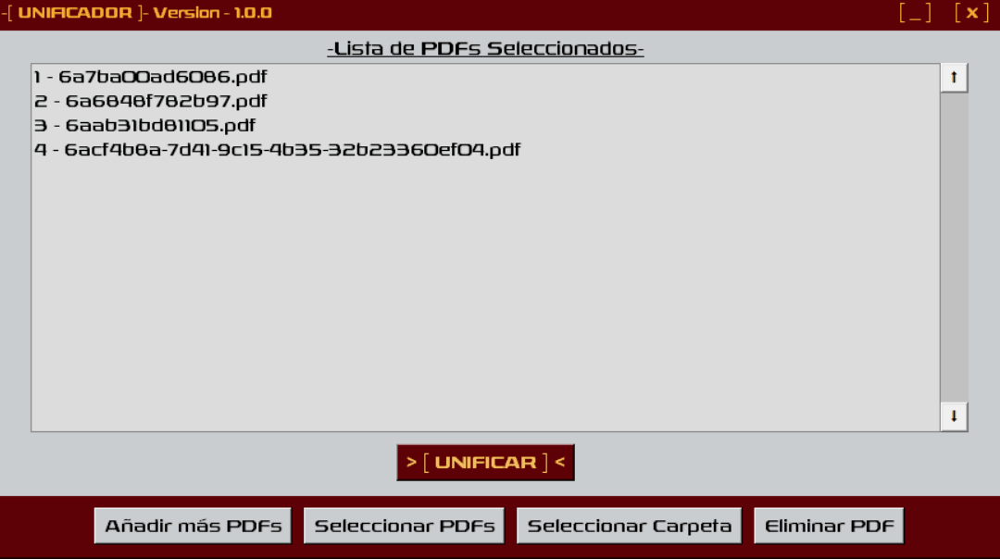

# -[ Unificador ]-

A simple Windows desktop application for merging multiple PDF files into a single PDF document.

The buttons are in spanish, if people want it in english i would make a language selector, but this
was a personal tool proyect i did for me, but maybe its usefull for you, so you´re welcolme.



## Features

* Merge multiple PDF files into one document.
* Select individual PDF files.
* Select an entire folder of PDFs.
* Reorder files before merging.
* Remove files from the list.
* Custom desktop interface whit Tkinter. (You can do very pretty stuff whit simple tools)
* Available as a standalone Windows executable. (¡¡¡PORTABLEE!!!)

## Requirements

* Windows
* Python 3.x (only required when running from source)

### Python dependencies

```text
pypdf
```

## Running from source

Install the required dependency:

```bash
pip install pypdf
```

Then run:

```bash
python main_Unificador.py
```

## Building

The application can be packaged as a standalone `.exe` using PyInstaller.

Example:

```bash
python -m PyInstaller --onefile --windowed --name "Unificador_v1.0.0" --icon "Unificador.ico" --add-data "Unificador.ico;." --add-data "Rexlia.otf;." main_Unificador.py
```

## License

This project is licensed under the MIT License.

## Status

Unificador is currently finished, but very open to improvment if you have suggestions.
